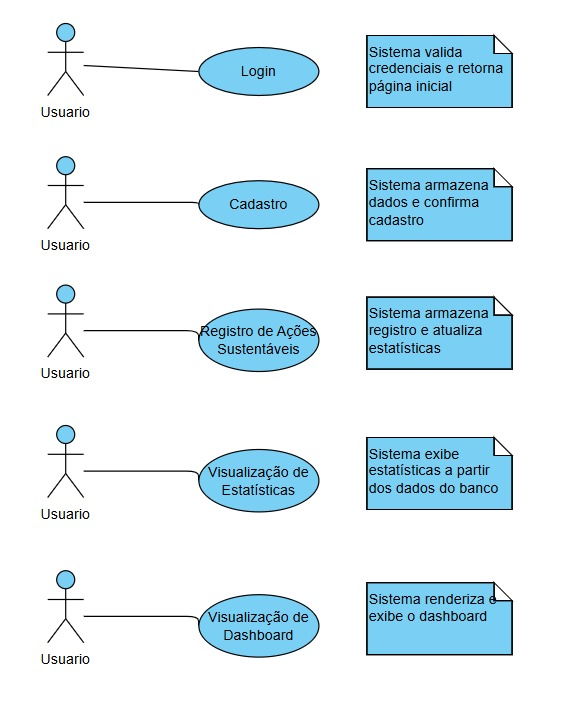
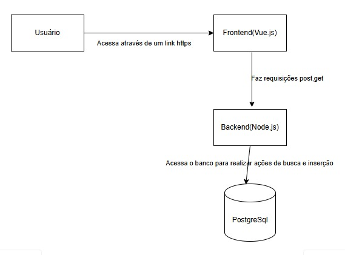
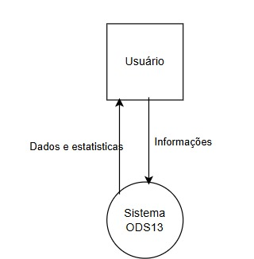
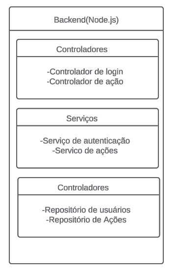

# Documentação do Projeto: Sistema para Gerenciamento de Ações Sustentáveis

## Tema Escolhido
**Objetivo de Desenvolvimento Sustentável (ODS):** ODS 13 - Ação contra a mudança global do clima.

## Problema a ser Resolvido
Desenvolver uma solução para ajudar indivíduos e organizações a gerenciar ações cotidianas que contribuem para a redução da pegada de carbono e a mitigação das mudanças climáticas.

## Tipo de Solução
Um sistema web com front-end e back-end, permitindo aos usuários registrar e monitorar suas ações sustentáveis, além de visualizar estatísticas e sugestões de práticas ambientalmente responsáveis.

## Requisitos Funcionais
1. Cadastro de usuários com login seguro.
2. Registro de ações sustentáveis realizadas pelos usuários.
3. Exibição de estatísticas sobre as ações registradas.
4. Exibição de dados sobre o projeto e ações que podem contribuir.
5. Dashboard com visão geral das atividades.

## Requisitos Não Funcionais
1. Segurança: proteção adequada dos dados dos usuários.
2. Usabilidade: interface amigável e intuitiva.
3. Performance: resposta rápida às requisições do usuário.
4. Escalabilidade: capacidade de lidar com aumento no número de usuários e dados.

## Diagrama de Caso de Uso

- **Ator Principal:** Usuário
- **Casos de Uso:**
  - Login
  - Cadastro
  - Registro de Ações Sustentáveis
  - Visualização de Estatísticas
  - Visualização de Dashboard

## GitHub e GitHub Projects
- **Repositório no GitHub:https://github.com/rafaelpmesquita/TP-ES-RAFAEL_MESQUITA
- **GitHub Projects:https://github.com/users/rafaelpmesquita/projects/1/views/1

# Planejamento

## Sprint TP1 - Workshop de Requisitos e Planejamento Inicial
- **Entregas:**
  1. Repositório do projeto criado no GitHub.
  2. Planejamento inicial no GitHub Projects, incluindo backlog de projeto.
  3. Documentação dos requisitos do projeto em markdown.

## Sprint TP2 - Projeto de Software e Plano de Testes
- **Entregas:**
  1. Arquitetura do projeto utilizando C4 model.
     - 
     - 
     - 
  2. Documentação da arquitetura no repositório (tecnologias escolhidas, modelo arquitetural, justificativa).
     - 
     - **Tecnologias:** 
       1. **Frontend:** Vue.js + Typescript + axios + vuetify
          - Trabalho com as tecnologias e tenho facilidade
       2. **Backend:** Node.js + Express
          - Rápido e simples de criar e utilizar para realizar uma API
       3. **Banco:** PostgreSQL
          - Banco de dados relacional relativamente fácil de usar

  3. Página de planos de testes com casos de teste para cada caso de uso.
  4. Atualização do GitHub Projects com o planejamento para o próximo sprint.

## Sprint TP3 - Entrega Final
- **Entregas:**
  1. Implementação da solução no repositório do projeto.
  2. Vídeo de apresentação da solução, incluindo ODS, problema, proposta de solução e demonstração.
  3. Código hospedado no repositório.
  4. Revisão final da documentação do repositório.

