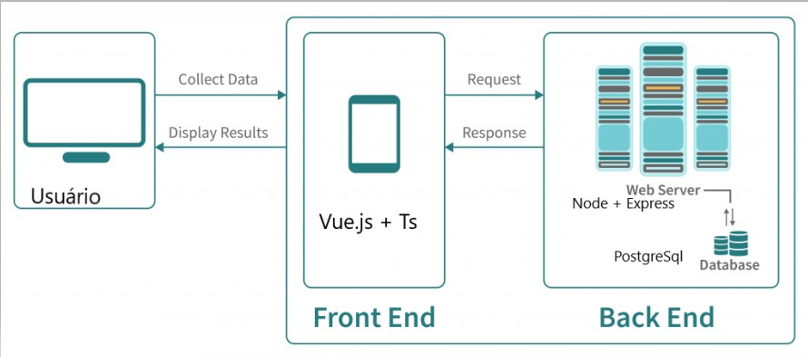

# Documentação do Projeto: Sistema para Gerenciamento de Ações Sustentáveis

## Tema Escolhido
**Objetivo de Desenvolvimento Sustentável (ODS):** ODS 13 - Ação contra a mudança global do clima.

## Problema a ser Resolvido
Desenvolver uma solução para ajudar indivíduos e organizações a gerenciar ações cotidianas que contribuem para a redução da pegada de carbono e a mitigação das mudanças climáticas.

## Tipo de Solução
Um sistema web com front-end e back-end, permitindo aos usuários registrar e monitorar suas ações sustentáveis, além de visualizar estatísticas e sugestões de práticas ambientalmente responsáveis.

## Requisitos Funcionais
1. Cadastro de usuários com login seguro.
2. Registro de ações sustentáveis realizadas pelos usuários.
3. Exibição de estatísticas sobre as ações registradas.
4. Exibição de dados sobre o projeto e ações que podem contribuir.
5. Dashboard com visão geral das atividades.

## Requisitos Não Funcionais
1. Segurança: proteção adequada dos dados dos usuários.
2. Usabilidade: interface amigável e intuitiva.
3. Performance: resposta rápida às requisições do usuário.
4. Escalabilidade: capacidade de lidar com aumento no número de usuários e dados.

## Diagrama de Caso de Uso

- **Ator Principal:** Usuário
- **Casos de Uso:**
  - Login
  - Cadastro
  - Registro de Ações Sustentáveis
  - Visualização de Estatísticas
  - Visualização de Dashboard

## GitHub e GitHub Projects
- **Repositório no GitHub:https://github.com/rafaelpmesquita/TP-ES-RAFAEL_MESQUITA
- **GitHub Projects:https://github.com/users/rafaelpmesquita/projects/1/views/1

# Planejamento

## Sprint TP1 - Workshop de Requisitos e Planejamento Inicial
- **Entregas:**
  1. Repositório do projeto criado no GitHub.
  2. Planejamento inicial no GitHub Projects, incluindo backlog de projeto.
  3. Documentação dos requisitos do projeto em markdown.

## Sprint TP2 - Projeto de Software e Plano de Testes
- **Entregas:**
  1. Arquitetura do projeto utilizando C4 model.
     - 
     - 
     - 
  2. Documentação da arquitetura no repositório (tecnologias escolhidas, modelo arquitetural, justificativa).
     - 
     - **Tecnologias:** 
       1. **Frontend:** Vue.js + Typescript + axios + vuetify
          - Trabalho com as tecnologias e tenho facilidade
       2. **Backend:** Node.js + Express
          - Rápido e simples de criar e utilizar para realizar uma API
       3. **Banco:** PostgreSQL
          - Banco de dados relacional relativamente fácil de usar

  3. Página de planos de testes com casos de teste para cada caso de uso.
    ### Caso de Uso: Login

#### Objetivo
Verificar se o sistema permite que usuários façam login com sucesso utilizando credenciais válidas.

#### Casos de Teste

1. **CT-01:** Testar login com usuário e senha válidos.
   - **Pré-condição:** Usuário cadastrado no sistema.
   - **Passos:**
     1. Acessar a página de login.
     2. Inserir usuário e senha válidos.
     3. Clicar em "Entrar".
   - **Resultado esperado:** Usuário é redirecionado para a página inicial do sistema.

2. **CT-02:** Testar login com usuário inválido.
   - **Pré-condição:** Usuário não cadastrado no sistema.
   - **Passos:**
     1. Acessar a página de login.
     2. Inserir usuário inválido e senha válida.
     3. Clicar em "Entrar".
   - **Resultado esperado:** Exibir mensagem de erro informando que o usuário não existe.

3. **CT-03:** Testar login com senha inválida.
   - **Pré-condição:** Usuário cadastrado no sistema.
   - **Passos:**
     1. Acessar a página de login.
     2. Inserir usuário válido e senha inválida.
     3. Clicar em "Entrar".
   - **Resultado esperado:** Exibir mensagem de erro informando que a senha está incorreta.

### Caso de Uso: Cadastro

#### Objetivo
Verificar se o sistema permite que novos usuários se cadastrem corretamente.

#### Casos de Teste

1. **CT-04:** Testar cadastro de novo usuário com informações válidas.
   - **Pré-condição:** Usuário não cadastrado no sistema.
   - **Passos:**
     1. Acessar a página de cadastro.
     2. Preencher formulário com informações válidas.
     3. Clicar em "Cadastrar".
   - **Resultado esperado:** Usuário é cadastrado com sucesso e redirecionado para a página de login.

2. **CT-05:** Testar cadastro com campos obrigatórios não preenchidos.
   - **Pré-condição:** Nenhuma.
   - **Passos:**
     1. Acessar a página de cadastro.
     2. Deixar um ou mais campos obrigatórios em branco.
     3. Clicar em "Cadastrar".
   - **Resultado esperado:** Exibir mensagens de erro indicando os campos obrigatórios que faltam preenchimento.

### Caso de Uso: Registro de Ações Sustentáveis

#### Objetivo
Verificar se o sistema permite que usuários registrem suas ações sustentáveis corretamente.

#### Casos de Teste

1. **CT-06:** Testar registro de uma ação sustentável válida.
   - **Pré-condição:** Usuário logado no sistema.
   - **Passos:**
     1. Acessar a funcionalidade de registro de ação sustentável.
     2. Preencher formulário com informações válidas.
     3. Clicar em "Registrar".
   - **Resultado esperado:** A ação sustentável é registrada com sucesso.

2. **CT-07:** Testar registro de uma ação sem preencher todos os campos obrigatórios.
   - **Pré-condição:** Usuário logado no sistema.
   - **Passos:**
     1. Acessar a funcionalidade de registro de ação sustentável.
     2. Deixar um ou mais campos obrigatórios em branco.
     3. Clicar em "Registrar".
   - **Resultado esperado:** Exibir mensagens de erro indicando os campos obrigatórios que faltam preenchimento.

### Caso de Uso: Visualização de Estatísticas

#### Objetivo
Verificar se o sistema exibe corretamente as estatísticas das ações sustentáveis registradas.

#### Casos de Teste

1. **CT-08:** Testar exibição de estatísticas com dados válidos.
   - **Pré-condição:** Usuário logado no sistema e ações sustentáveis registradas.
   - **Passos:**
     1. Acessar a funcionalidade de visualização de estatísticas.
     2. Verificar se as estatísticas são exibidas corretamente conforme esperado.

2. **CT-09:** Testar exibição de estatísticas sem dados registrados.
   - **Pré-condição:** Usuário logado no sistema sem ações sustentáveis registradas.
   - **Passos:**
     1. Acessar a funcionalidade de visualização de estatísticas.
     2. Verificar se é exibida uma mensagem indicando a ausência de dados.

### Caso de Uso: Visualização de Dashboard

#### Objetivo
Verificar se o sistema exibe corretamente o dashboard com visão geral das atividades.

#### Casos de Teste

1. **CT-10:** Testar exibição do dashboard com dados válidos.
   - **Pré-condição:** Usuário logado no sistema e ações sustentáveis registradas.
   - **Passos:**
     1. Acessar a funcionalidade de visualização do dashboard.
     2. Verificar se as informações são apresentadas corretamente conforme o design especificado.

2. **CT-11:** Testar exibição do dashboard sem dados registrados.
   - **Pré-condição:** Usuário logado no sistema sem ações sustentáveis registradas.
   - **Passos:**
     1. Acessar a funcionalidade de visualização do dashboard.
     2. Verificar se é exibida uma mensagem indicando a ausência de dados.
  4. Atualização do GitHub Projects com o planejamento para o próximo sprint.

## Sprint TP3 - Entrega Final
- **Entregas:**
  1. Implementação da solução no repositório do projeto.
  2. Vídeo de apresentação da solução, incluindo ODS, problema, proposta de solução e demonstração.
  3. Código hospedado no repositório.
  4. Revisão final da documentação do repositório.

